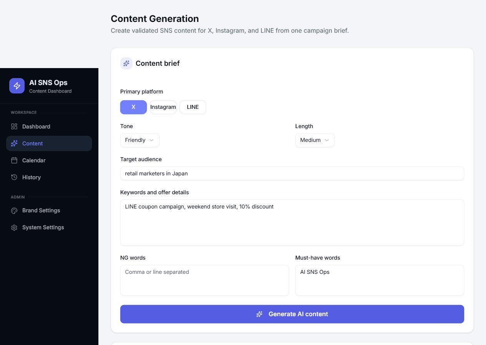
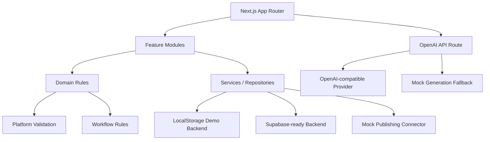

# AI SNS Ops Dashboard

日本市場向けのSNS運用支援ダッシュボードです。AI生成、ブランドルール検証、投稿スケジュール、履歴管理、分析ダッシュボードを統合しています。OpenAI API が未設定の環境でも mock generation で完全なデモを確認できます。

AI SNS Ops Dashboard is an AI SNS content operations dashboard for marketing teams. It turns one campaign brief into platform-specific copy for X, Instagram, and LINE, validates the content against brand and platform rules, stores reusable history, schedules posts, demonstrates a mock publishing queue, and shows repository-driven analytics.



## Highlights

- AI content generation with real OpenAI-compatible API support and deterministic mock fallback.
- Multi-platform preview for X, Instagram, and LINE from one campaign brief.
- Content validation for platform limits, hashtag limits, NG words, and must-have words.
- Generation history with reuse, export, favorite, status, and scheduling workflows.
- Calendar scheduling with month, week, day, and list views.
- Mock publishing queue that demonstrates job creation, retry, cancellation, and failure handling.
- Dashboard analytics backed by repository data for realistic demo scenarios.
- Supabase-ready repository layer with schema prepared for persistence migration.

## Tech Stack

- Next.js 16 App Router
- React 19
- TypeScript strict mode
- Tailwind CSS
- Radix UI and shadcn-style UI primitives
- Recharts
- OpenAI-compatible Chat Completions API
- LocalStorage demo backend
- Supabase-ready repository and SQL schema
- Vitest
- GitHub Actions CI

## Capability Boundaries

| Area                       | Status                                                           |
| -------------------------- | ---------------------------------------------------------------- |
| OpenAI content generation  | Real API supported through `app/api/content-generation/route.ts` |
| No-key public demo         | Supported through `generateMockContent` fallback                 |
| Supabase                   | Schema and repository prepared in `services/repositories`        |
| Publishing                 | Mock connector for demo queue behavior                           |
| Analytics                  | Repository-driven mock/demo data                                 |
| OAuth and real SNS posting | Planned extension, intentionally not claimed as complete         |

## Architecture



## Directory Structure

- `app/`: Next.js pages, layouts, API routes, loading/error UI, and global styles.
- `features/`: product workflows such as content generation, calendar, dashboard, history, and navigation.
- `domain/`: side-effect-free types, validation rules, workflow rules, labels, and demo data.
- `services/`: OpenAI client, schedule service, publishing service, analytics service, and repository implementations.
- `components/ui/`: shared generic UI primitives.

## Data and Integrations

The default backend is `localStorage`, so the project runs as a complete demo after cloning.

```bash
NEXT_PUBLIC_DATA_BACKEND=localStorage
```

Supabase can be enabled with:

```bash
NEXT_PUBLIC_DATA_BACKEND=supabase
NEXT_PUBLIC_SUPABASE_URL=https://your-project-ref.supabase.co
NEXT_PUBLIC_SUPABASE_PUBLISHABLE_KEY=your-publishable-or-anon-key
```

Create the Supabase tables with:

```bash
services/repositories/supabase-schema.sql
```

## AI Generation

Configure server-side credentials in `.env.local` when using a real provider:

```bash
OPENAI_API_KEY=your-api-key
OPENAI_BASE_URL=https://api.openai.com/v1
OPENAI_MODEL=gpt-4o-mini
```

When `OPENAI_API_KEY` is empty, the API route returns deterministic mock copy instead of failing. This keeps `pnpm install && pnpm dev` usable for reviewers without private credentials.

## Demo Scenarios

The included demo data reflects practical SNS operations:

- Retail weekend campaign
- Cafe seasonal drink launch
- Beauty product launch review hold
- B2B seminar announcement
- LINE coupon campaign

## Getting Started

```bash
pnpm install
cp .env.example .env.local
pnpm dev
```

Open [http://localhost:3000](http://localhost:3000).

## Quality Gate

```bash
pnpm typecheck
pnpm lint
pnpm test
pnpm format:check
pnpm build
pnpm check
```

`pnpm check` runs type checking, linting, focused unit tests, Prettier validation, and the production build.

Focused business-rule tests cover:

- `domain/validation.test.ts`
- `domain/workflow.test.ts`
- `services/schedule-service.test.ts`
- `services/content-generation.test.ts`

GitHub Actions runs the same production-oriented checks on pushes and pull requests.
